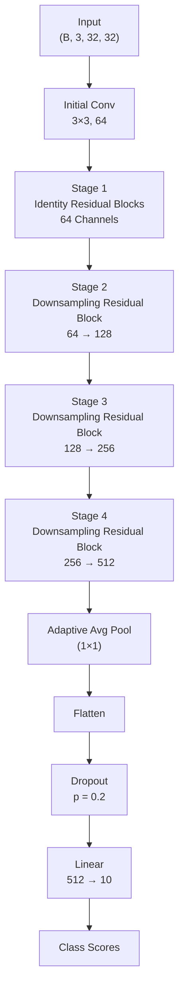

# Project Overview

This project features a hand-built Residual Network (ResNet) implemented from scratch without using any pretrained ResNet models from `torchvision`. The residual blocks, skip connections, and downsampling operations were manually implemented.

Core features implemented manually:

- Identity Residual Blocks
- Downsampling Residual Blocks
- Skip Connections
- Custom CIFAR-10 Dataset Pipeline

---

## Implementation Summary

| | |
|----------------------|--------------------------------------------------------------------------------------------------------------------------------|
| **Task** | Image Classification |
| **Framework** | PyTorch |
| **Architecture** | Custom ResNet |
| **Input Resolution** | 32 × 32 RGB Images |
| **Dataset** | CIFAR-10 |
| **Number of Classes** | 10 |
| **Feature Channels** | 64 → 128 → 256 → 512 |
| **Pooling** | Adaptive Average Pooling |
| **Classification Head** | Dropout(0.2) → Linear(512→10) |
| **Loss Function** | Cross-Entropy Loss |
| **Optimizer** | SGD with Momentum and Nesterov |
| **Evaluation Metrics** | Accuracy, Precision, Recall, F1 Score |
| **Objective** | Learn hierarchical image representations using deep residual learning for robust image classification. |

---

# Model Architecture

---

## Compact Stage Table

| Stage | Operation | Shape Before | Shape After |
|---|---|---|---|
| Raw Input | — | `(B, 3, 32, 32)` | `(B, 3, 32, 32)` |
| Initial Convolution | Conv + BN + ReLU | `(B, 3, 32, 32)` | `(B, 64, 32, 32)` |
| Stage 1 | Identity Residual Blocks | `(B, 64, 32, 32)` | `(B, 64, 32, 32)` |
| Stage 2 | Downsampling Residual Block | `(B, 64, 32, 32)` | `(B, 128, 16, 16)` |
| Stage 3 | Downsampling Residual Block | `(B, 128, 16, 16)` | `(B, 256, 8, 8)` |
| Stage 4 | Downsampling Residual Block | `(B, 256, 8, 8)` | `(B, 512, 4, 4)` |
| Global Pooling | AdaptiveAvgPool2d(1) | `(B, 512, 4, 4)` | `(B, 512, 1, 1)` |
| Flatten | Flatten | `(B, 512, 1, 1)` | `(B, 512)` |
| Classification Head | Dropout → Linear(512→10) | `(B, 512)` | `(B, 10)` |

# Results

| Metric | Value |
|--------------------------|----------------|
| **Training Accuracy** | **99.40%** |
| **Best Validation Accuracy** | **93.78%** |
| **Test Accuracy** | **95.00%** |
| **Macro Precision** | **95.00%** |
| **Macro Recall** | **95.00%** |
| **Macro F1-Score** | **95.00%** |
| **Weighted F1-Score** | **95.00%** |

---

## Performance Summary

- Achieved **99.40% training accuracy** and **93.78% validation accuracy** 
- **95% macro precision, recall and F1-score** were achieved by the model, showing balanced performance
- Achieved an overall **test accuracy of 95%** on the cifar-10
- Adaptive average pooling reduced the number of trainable parameters before the classifier and preserved high-level semantic features.
- When we look at the confusion matrix we see that most of the predictions are on the diagonal, meaning the predictions are mostly correct. The highest mispredictions are between visually similar classes such as **cat ↔ dog** and **truck ↔ car**

---

## Per-Class Performance

| Class | Precision | Recall | F1-Score |
|--------|----------:|-------:|---------:|
| Plane | 0.94 | 0.96 | 0.95 |
| Car | 0.97 | 0.99 | 0.98 |
| Bird | 0.95 | 0.92 | 0.94 |
| Cat | 0.89 | 0.91 | 0.90 |
| Deer | 0.94 | 0.97 | 0.95 |
| Dog | 0.92 | 0.91 | 0.92 |
| Frog | 0.96 | 0.97 | 0.96 |
| Horse | 0.98 | 0.96 | 0.97 |
| Ship | 0.97 | 0.96 | 0.97 |
| Truck | 0.98 | 0.96 | 0.97 |