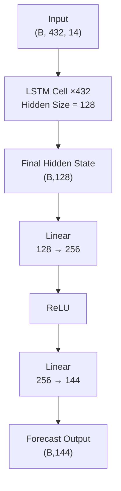

# Project Overview

This project features a hand-built Long Short-Term Memory (LSTM) network implemented entirely from scratch without using `nn.LSTM`. All gate computations and state updates were manually implemented.

Core features implemented manually:

- Custom LSTM Cell
- Forget, Input, Candidate and Output Gates
- Hidden State & Cell State Updates
- Multi-Step Forecasting Head
- Custom Dataset Class

---

## Implementation Summary

| | |
|----------------------|-----------------------------------------------------------------------------------------------------------------------------------|
| **Task** | Direct Multi-Step Weather Forecasting |
| **Framework** | PyTorch |
| **Architecture** | Vanilla LSTM (implemented from scratch) |
| **Input Window** | 432 timesteps |
| **Output Horizon** | 144 timesteps |
| **Forecasting Type** | Non-Autoregressive |
| **Dataset** | Jena Climate Dataset |
| **Features** | Temperature, Humidity, Pressure, Wind Speed, Wind Direction, etc. |
| **Hidden Size** | 128 |
| **Prediction Head** | Linear(128→256) → ReLU → Linear(256→144) |
| **Loss Function** | Mean Squared Error (MSE) |
| **Evaluation Metrics** | MAE, RMSE, R² Score |
| **Objective** | Learn long-term temporal dependencies for direct multi-horizon weather forecasting. |

---

# Model Architecture

---

## Compact Stage Table

| Stage | Operation | Shape Before | Shape After |
|---|---|---|---|
| Raw Input | — | `(B, 432, 14)` | `(B, 432, 14)` |
| Recurrent Processing | Custom LSTM Cell ×432 | `(B, 432, 14)` | `(B, 128)` |
| Hidden Projection | `Linear(128,256)` | `(B,128)` | `(B,256)` |
| Activation | `ReLU` | `(B,256)` | `(B,256)` |
| Output Layer | `Linear(256,144)` | `(B,256)` | `(B,144)` |

---

# Results

## Overall Performance

| **Metric** | **Value** |
|------------------------|----------:|
| MAE | **1.756 °C** |
| RMSE | **2.318 °C** |
| R² Score | **0.9001** |
| Correlation Coefficient | **0.9490** |

---

## Error Distribution

| **Statistic** | **Value** |
|--------------|----------:|
| Best MAE | **0.322 °C** |
| Median MAE | **1.614 °C** |
| Mean MAE | **1.756 °C** |
| Worst MAE | **6.326 °C** |

---

## Error Analysis

| **MAE Threshold** | **Samples** |
|-------------------|------------:|
| > 1 °C | 1272 |
| > 2 °C | 491 |
| > 3 °C | 122 |
| > 4 °C | 35 |
| > 5 °C | 11 |
| > 6 °C | 3 |
| **Total Test Samples** | **1548** |